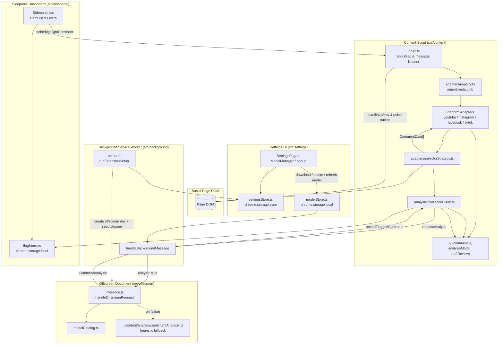

# NoH8 Architecture

> High-level overview of NoH8's runtime architecture, data flow, entry points,
> and module responsibilities. Companion to `../AGENTS.md`.

## 1. Runtime Model

NoH8 is a **Chrome/Firefox browser extension (Manifest V3)** that runs entirely
on-device. It spreads across several browser *contexts* that exchange structured
messages over `chrome.runtime`:

| Context | Entry point | Role |
| --- | --- | --- |
| Content script | `src/content/index.ts` | Injected into social pages; discovers comments in the DOM, runs on-device inference, and renders the NoH8 UI. |
| Background service worker | `src/background/serviceWorker.ts` | Runs one-time setup, ensures the offscreen document exists, and relays messages to it. |
| Offscreen document | `src/offscreen/index.ts` | Headless page hosting the heavy Transformers.js (`@xenova/transformers`) ONNX pipeline. |
| Settings UI | `src/settings/main.tsx`, `SettingsPage.tsx`, popup | Lives in `settings.html` / `popup.html`; toggles platforms, manages model downloads, reviews drafts. |
| Sidepanel Dashboard | `src/sidepanel/main.tsx`, `Sidepanel.tsx` | Lives in `sidepanel.html` (and Firefox sidebar); aggregates flagged comments live, allows issue filtering, and triggers jump-to-comment navigation. |

Shared contracts: data shapes in `src/shared/types.ts`; the messaging wire
protocol in `src/shared/messages.ts`; platform identities/URLs in
`src/settings/types.ts` and `src/content/platformConfig.ts`.

## 2. End-to-End Data Flow

---

## 3. Module Responsibilities

### Content script layer (`src/content/`)
- **`index.ts`** — boots all enabled platform adapters after hydrating the settings store; wires discovered comments to inference; renders controls and draft-review buttons; listens for `noh8:highlightComment` from the sidepanel.
- **`platformConfig.ts`** — single source of per-platform host match patterns used to scope the manifest and runtime permissions.
- **`adapters/`** — concrete platform adapters (`youtubeAdapter.ts`, `instagramAdapter.ts`, `facebookAdapter.ts`, `tiktokAdapter.ts`) extending `BaseAdapter`. `selectorStrategy.ts` provides fallback container selection.
- **`analysis/`** — `inferenceClient.ts` (offscreen client wrapper), `inferenceScheduler.ts` (concurrency-capped, deduplicating, caching scheduler wrapping the client), and `sentimentAnalyzer.ts` (deterministic keyword heuristic fallback).
- **`ui/`** — modularized UI layer:
  - `uiTypes.ts` — structural DOM and UI option interfaces.
  - `commentUi.ts` — entry point and rainbow button generator.
  - `analysisModal.ts` — detailed sentiment/hate-speech breakdown modal.
  - `draftReview.ts` — comment draft pre-posting review helper.
  - `reportHelper.ts` — per-platform report URLs and actions.

### Background layer (`src/background/`)
- **`serviceWorker.ts`** — listens for message routing and registers install/startup hooks.
- **`setup.ts`** — creates the offscreen document, seeds default model settings, and relays messages to the offscreen document.

### Offscreen layer (`src/offscreen/`)
- **`inference.ts`** — owns `@xenova/transformers` ONNX pipeline instances, handles download/delete/refresh model commands, and executes text analysis with heuristic fallback.
- **`modelCatalog.ts`** — catalog descriptors and output-to-`CommentAnalysis` parser.
- **`client.ts`** — client messaging bridge towards the offscreen document.

### Sidepanel layer (`src/sidepanel/`)
- **`flagStore.ts`** — Zustand store and `chrome.storage.local` persistence for flagged comment aggregation, live filtering, false-positive dismissal (per-comment, persisted), and storage listener synchronization.
- **`flagExport.ts`** — pure JSON export serialization of flagged comments (newest-first, DOM references stripped) for the dashboard's Export JSON action.
- **`Sidepanel.tsx`** — interactive dashboard for active-tab and global comment review with "Jump", "Report", "Dismiss", and "Export JSON" actions.

### Settings layer (`src/settings/`)
- **`settingsStore.ts`** (→ `chrome.storage.sync`) — enabled platforms, review drafts preference, and permissions.
- **`modelStore.ts`** (→ `chrome.storage.local`) — selected model, downloaded models, and download progress.
- **React UI** — `SettingsPage`, `ModelManager`, and `SettingsPopup`.

## 4. Storage & Permissions

- Settings (`chrome.storage.sync`): enabled platforms + review-drafts flag.
- Models & Flags (`chrome.storage.local`): selected/downloaded models, download progress, and flagged comment review history.
- Permissions: `host_permissions` declares social platform origins and Hugging Face model CDNs; `sidePanel` declares side panel access.
- Network scope: strictly local inference; network requests are exclusively for downloading model weights from Hugging Face.

## 5. Extending the System

- **Add a platform:** create `content/adapters/<platform>Adapter.ts`, register patterns in `platformConfig.ts`, update `Platform` union in `settings/types.ts`, and add a unit test suite mirroring the existing adapter tests.
- **Add a model:** extend `offscreen/modelCatalog.ts` and add unit test coverage in `tests/unit/modelCatalog.test.ts`.
- **Add a message:** declare in `src/shared/messages.ts`, type the discriminated union, and handle in `serviceWorker.ts` / `index.ts`.